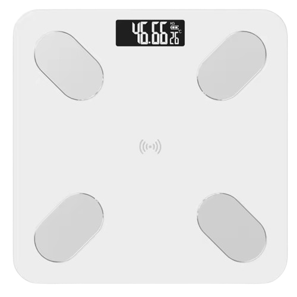

# yoda1-sniffer
This script grabs weight data that is transmitted by a 
`yoda1` scale over BLE for anyone to listen to

## Usage
```
usage: sniffer.py [-h] [-a ADDRESS] [-t TIMEOUT]

yoda1-sniffer - a tool to grab weight data transmitted from a yoda1 bluetooth scale

options:
  -h, --help            show this help message and exit
  -a, --address ADDRESS
                        Bluetooth MAC address of the scale (default: None)
  -t, --timeout TIMEOUT
                        Discovery scan timeout in seconds (default: None)
```

## Instructions
- This script requires the device to be turned on (either by stepping on or 
clicking the button on the back side of the scale) for it to be discovered.

- When the device is discovered, the script will automatically listen 
for all advertisments from it's MAC address indefinitely

## Basic Examples
Running the tool to automatically discover any close `yoda1` scale, and listen for it
```shell
python sniffer.py
```

Running the tool, but skipping discovery and directly listening for a specific MAC address
```shell
python sniffer.py -a 50:FB:19:XX:XX:XX
```

## Notes
- This script is hardcoded to discover MAC addresses starting with `50:FB:19`. If your
scale's MCU is manufactured by a different company *for some reason*, you might want to edit it.

## Requirements
- Python 3.9 or newer
- A Bluetooth interface
- An OS compatible with [Bleak's requirements](https://github.com/hbldh/bleak?tab=readme-ov-file#features)

## Scale image

